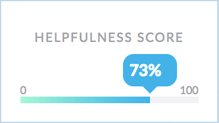

Networking isn’t necessarily about scoring a sexy new job (or a cubicle with a window). It’s about being human, and helping people out. It’s just basic decency in the professional sphere.

So if you feel intimidated, remember that networking can be crazy simple. It can mean offering a piece of advice, or connecting someone with a colleague. It can be sending a helpful article to a friend of a friend. Or it could be a 15 minute phone call that turns into a long and fruitful collaboration.

**None of these actions take a lot of time or energy, but they’re incredibly meaningful.**

Sometimes it can be hard to know if all those small acts of kindness really help move your career forward, but that’s not a reason to stop. Moments of connection are likely to be remembered, and they can come back around to surprise you in wonderful ways.

If you’re [feeling down][link1] or are in the middle of a slow job search, that’s an extra wonderful reason to keep at it. Strengthening relationships in your network is a great way to stay productive and connected, even when times are tough.

We want to help keep things in perspective. Even if you’re not yet dazzling your way into your dream job, you can still be awesome at networking. Now on [BrightCrowd][brightcrowd] you can see a (rough!) measure of how you’re doing. It’s called a Helpfulness Score.

*Hey, you’re pretty helpful!*

On your profile you’ll see your score, and suggestions on how to improve it. You can try offering your expertise to the BrightCrowd community, or sending a personal message to someone you might be able to help. Simple steps like these can spark real relationships.

And if you run across someone super helpful on [BrightCrowd][brightcrowd], send them a message! Chances are they’ll be happy to meet you, too!

[link1]: https://blog.brightcrowd.us/when-things-are-tough-reach-out/
[brightcrowd]: https://brightcrowd.com
