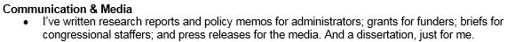
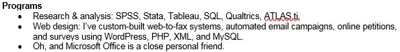

Job hunting can be tough. Partly because there’s often a power differential – you’re competing against other applicants for a single job, and the employer gets to choose.

So it’s understandable that many applicants leave their personality at the door, and submit cover letters and resumes that are professional, but bland and forgettable.

I’ve hired folks before, and let me tell you: reading all that blandness is painful. I actually felt grateful for the rare bits of originality or humor I came across – and it was a lot easier to give those applications the attention they deserved.

That experience has informed my own application style. Take this example from my “Skills” section:

<!--  -->

> “I’ve written research reports and policy memos for administrators; grants for funders; briefs for congressional staffers; and press releases for the media. __And a dissertation, just for me.__”

Or this one:

<!--  -->

> * “Research & analysis: SPSS, Stata, Tableau, SQL, Qualtrics, ATLAS ti
> * Web design: I’ve custom-built web-to-fax systems, automated email campaigns, online petitions, and surveys using Wordpress, PHP, XML, and MySQL.
> * __Oh, and Microsoft Office is a close personal friend.__”

In neither case am I distracting from the content I want to convey. I’m enhancing it, by making all that content easier to absorb.

And the feedback has been overwhelmingly positive. I’ve heard those very lines read back to me in multiple interviews, where they’ve helped break the ice and set a convivial tone.

At times, a bit of personality has also helped me evade questions I don’t want to answer. One posting bluntly stated that “Submissions without salary requirements won’t be considered.”

This happens to be a pet peeve of mine, because it exacerbates that existing power imbalance. It’s a one-way disclosure, and since you’re competing with other applicants, the salary you’ll probably share is the smallest you’re willing to accept.

And yet, I wanted to be considered. So I wrote this:

> The posting I found mentioned that “Submissions without salary requirements will not be considered.” I’m not exactly sure, but I think my upper limit is $1 million per year. Given my interest in serving the greater good, I’m not sure I could accept a job that paid more than that in good conscience.

Cheeky, I know. ___But I got the interview___.

Playing it safe would have maximized my chances – but it also would have compromised my integrity and yielded my leverage. And I have my own requirements - I want a job that treats me with respect, even when I question the status quo.

The bottom-line? A bit of personality can sometimes be a great thing.

_[Ryan Bodanyi][bio1] loves using knowledge and data to make the world a better place. But he’s not above using [Thai food][bio2] instead._

[bio1]: http://ryanbodanyi.org/bio.html
[bio2]: http://ryanbodanyi.org/cookingblog/tag/thai/
[brightcrowd]: https://brightcrowd.com
